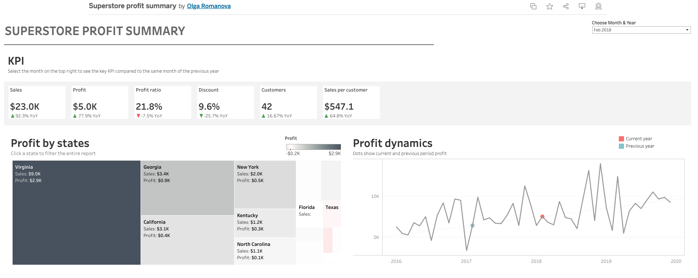
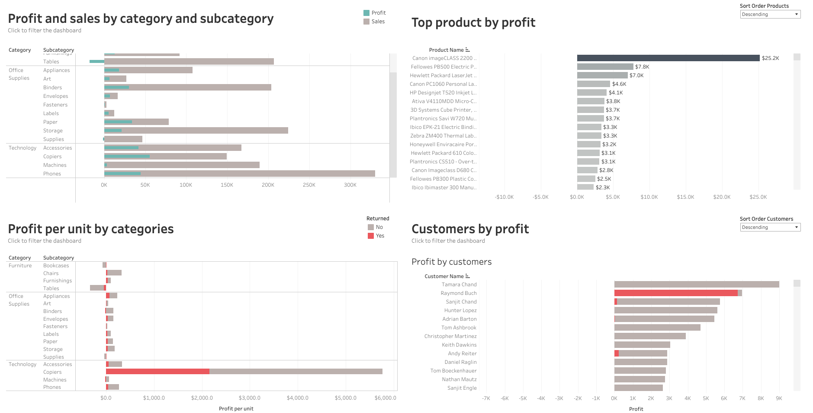

## Olga Romanova
Curious data analyst with solid background in marketing communications. 
Connect on [Linkedin](https://www.linkedin.com/in/olgaromanova-8/)

# PORTFOLIO. Data analyst

## 1. BABY ROUTINE: (MORE THAN) A FULL TIME JOB
Visualizing baby metrics, calculating parent time invested 

[Details](babytracker/readme.md) 

[Interactive visualization](https://public.tableau.com/app/profile/olga.romanova7546/viz/Baby_routine/Babyroutine)

**Tools**: PostgreSQL, DBeaver, Tableau

## 2. SUPERSTORE PROFIT SUMMARY
Working with the classic datasource. Some advanced visualization techniques: displaying current and previous period on the line chart; KPI cards with conditional formatting, focus on returned items.

[Details](superstore/readme.md) 

[Interactive visualization](https://public.tableau.com/app/profile/olga.romanova7546/viz/Superstore-onemoretime/Dashboard1)

**Tools**: PostgreSQL, DBeaver, Tableau, Google Looker, Amazon Quicksight

