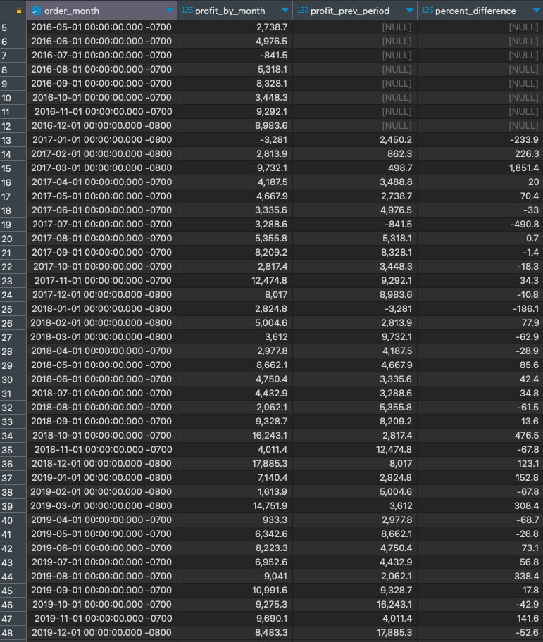
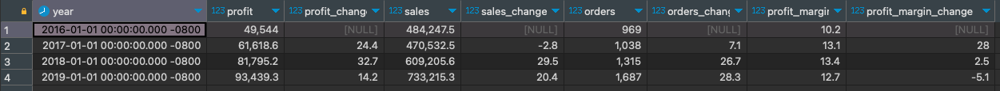
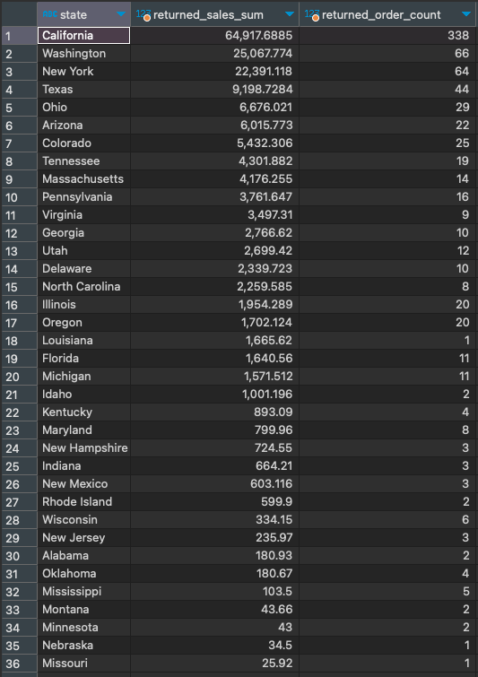
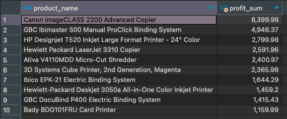
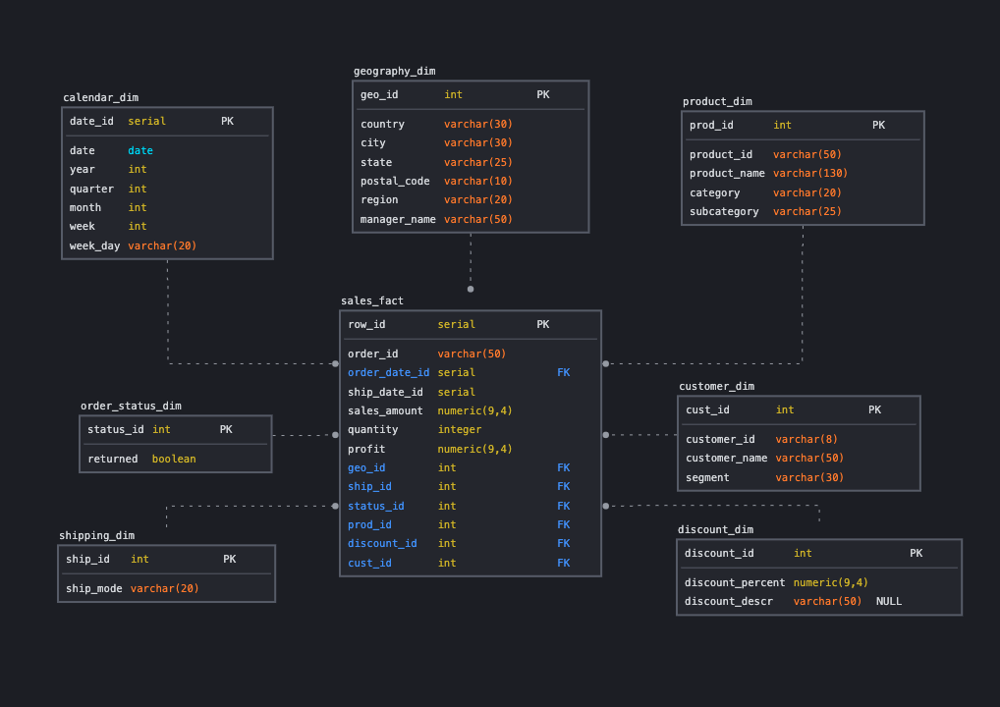
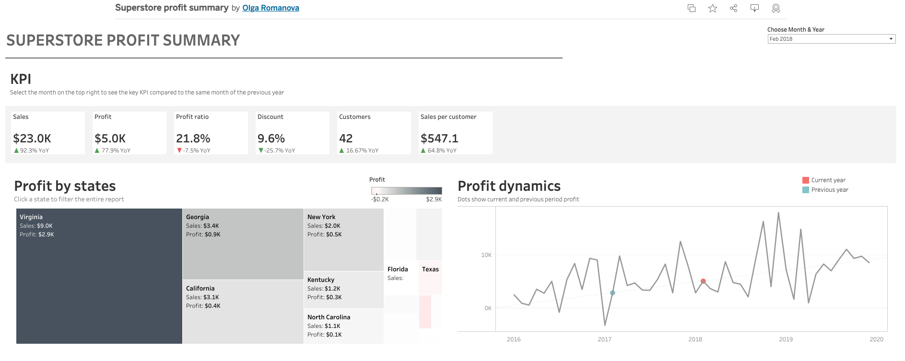
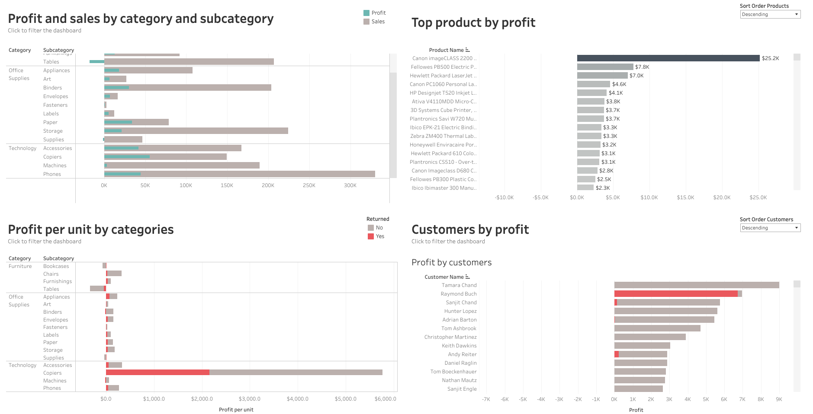
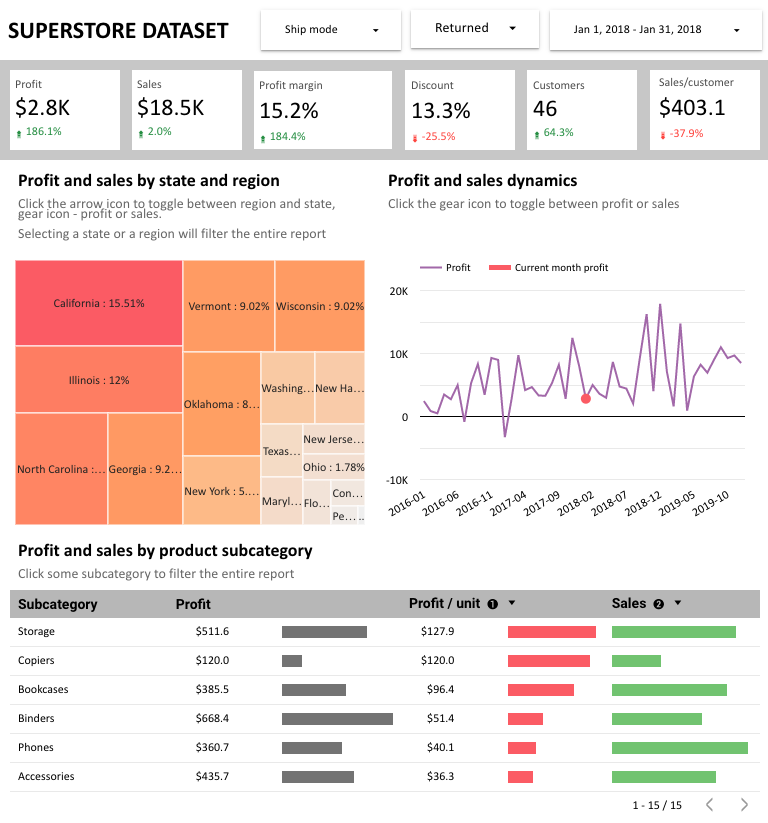
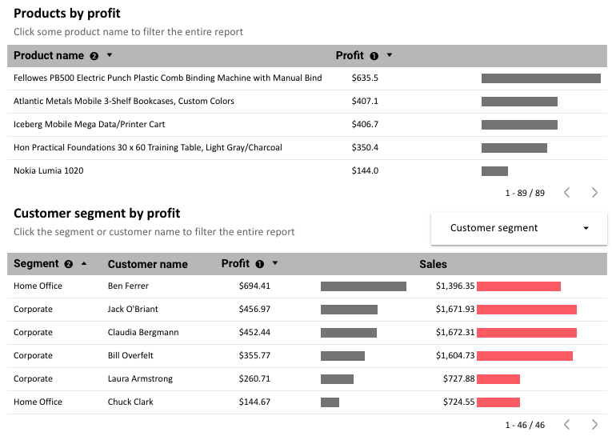
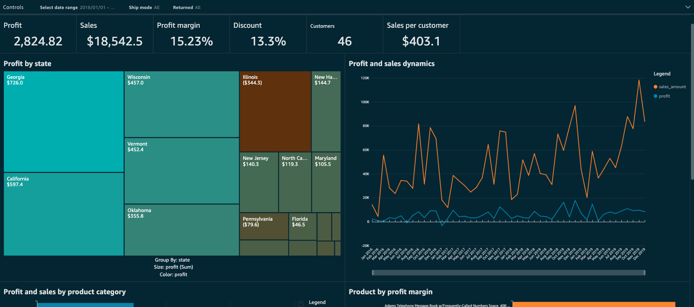

### Olga Romanova
# Portfolio. Business Intelligence Analyst

This entire project is based on the same [Superstore dataset](Sample-Superstore-dataset.xls). I used the tools listed below  to answer the same question: where does the money come from and where is it lost?

## SQL
To begin, I decided to work with the dataset as is, without any alterations. Below are some examples of queries that address the questions I explored in the data visualization parts.

I used PostgreSQL and DBeaver.

### 1.1 KPIs
```sql
/*Profit per month compared to the same month of the previous year (Year over year comparison)*/

SELECT
	date_trunc('month', order_date) AS order_month,
	ROUND(SUM(profit), 1) AS profit_by_month,
	ROUND(LAG(SUM(profit), 12) OVER w, 1) AS profit_prev_period,
	ROUND((SUM(profit)/LAG(SUM(profit), 12) OVER w - 1) * 100, 1) AS percent_difference
FROM
	orders o
GROUP BY
	order_month
WINDOW w AS (ORDER BY date_trunc('month', order_date))
ORDER BY 
	order_month;
```



```sql
/* Yearly KPI change, the change is shown in percent */

SELECT
	date_trunc('year', order_date) as year,
	ROUND(SUM(profit), 1) AS profit,
	ROUND((SUM(profit) / LAG(SUM(profit)) OVER w - 1) * 100, 1) AS profit_change,
	ROUND(SUM(sales), 1) AS sales,
	ROUND((SUM(sales) / LAG (SUM(sales)) OVER w - 1) * 100, 1) AS sales_change,
	COUNT(distinct order_id) AS orders,
	ROUND((count(distinct order_id)::numeric / LAG(count(distinct order_id)::numeric) OVER w - 1) * 100, 1) AS orders_change,
	ROUND(SUM(profit)/SUM(sales) *100, 1) AS profit_margin,
	ROUND(((SUM(profit)/SUM(sales)) / LAG(SUM(profit)/SUM(sales)) OVER w - 1) * 100, 1) AS profit_margin_change
FROM
        public.orders
GROUP BY
    year
WINDOW w AS (ORDER BY date_trunc('year', order_date))
ORDER BY
    year;
```



### 1.2 Lost profit by state
```sql
/* Lost profit. Returned orders by state */

SELECT
	state,
	SUM(sales) as returned_sales_sum,
	COUNT(returned) as returned_order_count
FROM
	public.orders as o
JOIN
	(SELECT
		DISTINCT order_id,
		returned
	FROM
		public."returns") AS r
ON o.order_id = r.order_id
GROUP BY
	state,
	r.returned
ORDER BY
	returned_sales_sum desc;
```




### 1.3 Top 10 products by profit
```sql
/* Top 10 product by profit */
SELECT
	product_name,
	ROUND(SUM(profit), 2) as profit_sum
FROM
	public.orders
GROUP BY
	product_name,
	orders.order_date
--filter by year if necessary
HAVING 
	date_trunc('year', order_date) = '2018-01-01'
ORDER BY
	SUM(profit) desc
LIMIT 
	10;			
```



You can see the [SQL script](SQL/sql-queries_superstore-db.sql) for more details.

## DATA MODEL

For creating the data model, I used [SqlDBM](https://sqldbm.com).


Check the script for creating the tables and inserting data [here](SQL/from_stg_to_dw_superstore.sql). I connected AWS RDS to my PostgreSQL instance.

## TABLEAU
View the interactive version [here](https://public.tableau.com/app/profile/olga.romanova7546/viz/Superstore-onemoretime/Dashboard1).
The KPIs showcase data compared to the same month of the previous year. The profit dynamics chart displays both dots (representing current and previous year profit) depending on the selected month and year.

My hypothesis was that returns significantly impact the profit, this can be seen on the bottom charts.




## GOOGLE LOOKER STUDIO

Essentially, the same questions were addressed using [Google Looker Studio](https://lookerstudio.google.com/reporting/e2b934b3-b338-4fcb-81fd-2cd2e8ab776f)




Here, I encountered a restriction/bug in Looker functionality with the chart 'Profit and sales dynamics'. When attempting to change data granularity in blended data (switching from daily to monthly aggregation), only the ticks on the X-axis change, while the data remains unchanged by days (not by months). To overcome this, I used a workaround at the data source level, adding the dimension 'year-month' in text format. Although not ideal, it serves the purpose. According to what I found on the internet, this bug has been known since 2021.

Additionally, there is no way to edit the format of the optional metric marker currently. Thus, if it was a dashboard for production, I would opt for two separate charts for sales and profit. 

## AMAZON QUICKSIGHT



Unfortunately, Quicksight allows only internal access to the dashboards and reports. 
I liked the level of flexibility that Quicksight provides in terms of data manipulation. However, it lacks the same flexibility from the point of view of style and design.

If you have any questions, please feel free to reach out here on [Linkedin](https://www.linkedin.com/in/olgaromanova-8/).