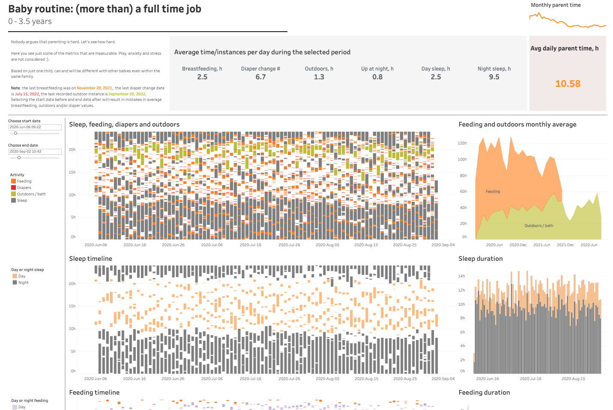

# BABY ROUTINE: (MORE THAN) A FULL TIME JOB

[Interactive visualization](https://public.tableau.com/app/profile/olga.romanova7546/viz/Baby_routine/Babyroutine)

The goal of this project is to answer the question: where did all time go when my daughter was younger, and what it takes to raise a child up to 3,5 years.

From my child's birth, I used the "Baby Tracker" app to keep the track of multiple areas of her life (`30,402` entries during approximately `3.8 years`). The app provides export into .xlsx file. Since the app was evolving througout those years, and I was not using it quite consistently, some cleaning was required to work with the data.

Additionally, I introduced some columns and calculations for correct visualization. If I had the task to store and update the data, I would use the different approach. Here, it was just one-time data entry and visualization.

## DATA CLEANING
[See the .sql script for details](baby-tracker.sql)
1. Imported .csv files via DBeaver into the staging schema:
- 30,402 rows in baby.veronica_source_file
- 63 rows in baby.veronica_source_file_notes

2. Created a separate schema viz_baby and a tracker table inside.

3. Inserted data from source tables:
    3.1 Converted date/time columns from string to timestamp.
    3.2 Added a calculation of duration.
    3.3 Ensured that all medication names are entered in the uniform way.

4. Manually inserted select values from notes (no single pattern to automate). Added 39 rows -> 30,441 rows total. 
The reason for this is that the app input was different in the beginning. Plus, I decided to add vaccination information.

5. Split rows that spanned two days into two parts (each row into two rows) for correct visualization. 
I used a temporary table for that: 
    5.1 Inserted rows replacing end time with the same date as the beginning, but time 23:59.
    5.2 Inserted rows replacing start time with the same date as the end, but time 00:00.
    5.3 Deleted the rows that span two days from the original table (1049 rows)
    5.4 Inserted data from the temporary table to the original table -> **31490 rows**.
6. Updated the table by extacting time from start and end timestamps and converting it to decimal for correct visualization.
7. Calculated time since previous and to next activities for:
    7.1 sleep (5167 rows),
    7.2 feeding (17714 rows),
    7.3 diaper changes (6306 rows).

## VISUALIZING

For this project I used Tableau.

The choice of graphics was pretty straightforward since there aren't many ways to visualize duration of several activities in time. 

1. To plot a timeline of all acitivites and sleep and feeding separately, I used gantt charts. This way it is easier to see the pattern of acitivities.
2. For total duration of multiple activities that require parents to devote their time, I selected stacked area charts to better show total time.
3. The sleep and feeding duration separately are visualized with the help of stacked bar charts.

### User experience

#### Filtering
The only filter that I decided to allow the users to control is selecting the start and the end date. 
Since this selected interval impacts the calculation of the 'KPIs', I had to make it via parameters and a filter. Unfortunately, Tableau doesn't support multiple-value parameters, so this is the explanation of not ideal implementation of two sliders.

Filtering the individual charts in the selected layout doesn't provide any additional value, therefore, not too much freedom for the viewers. 

#### Calculations
I introduced several additional calculations to display day/night sleep and feeding and to calculate KPIs and particularly total parent time.

First, I wanted to use quite complex logic for day/night sleep since the pattern was too chaotic, but for the same reason the best solution turned out to make it simple. 

For calculating parent time, I decided to add up the following:   feeding duration + diaper change instances * 5 min + outdoor time + 1 h + day sleep instances * 1.5 h + 2 h preparation for night sleep. 

Not all activities were recorded throughout the entire period: breastfeeding ended in the end of 2021, we said good bye to diapers in Summer 2022, and I just stopped recording our walks and meals in the end of 2022 and beginning of 2023 respectively. 

Therefore, the average numbers on top (breastfeeding, diaper change etc) will be wrong in case a viewer selects the end date after the activity wasn't recorded (and the start date will still return some values). But I decided not to limit the date range out of curiosity. In production environment, the choice would be in favour of stability and correctness. 

### Summary
Well, the numbers are really frightening, but if I had such information before I had my daughter, that could help a lot. Even though all babies and parents are different, I still remember my devastation that breastfeeding takes so much time. Being more prepared would be benefitial for sure.

